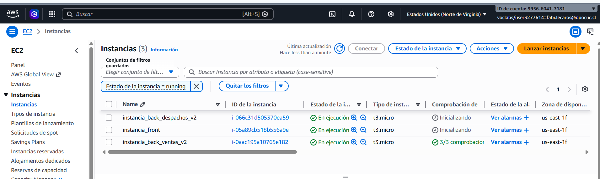
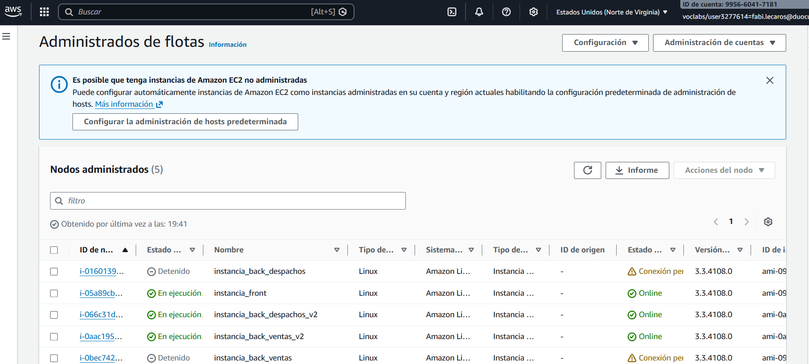
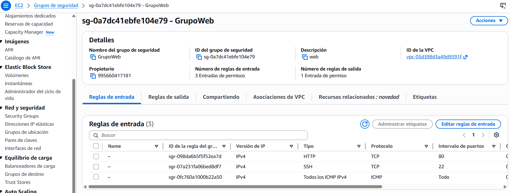
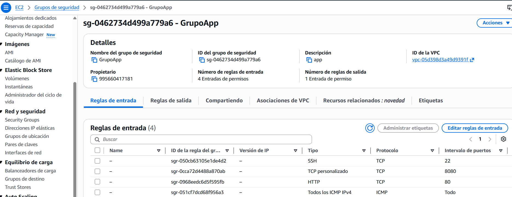
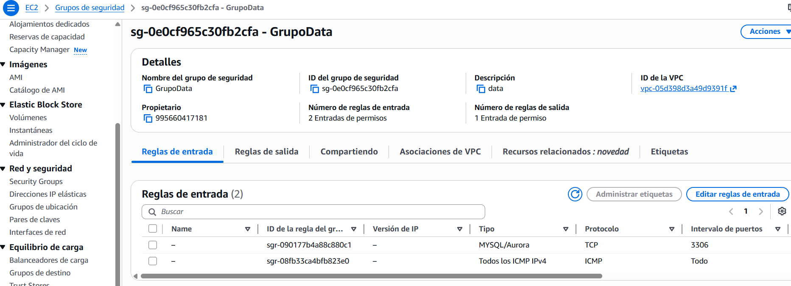
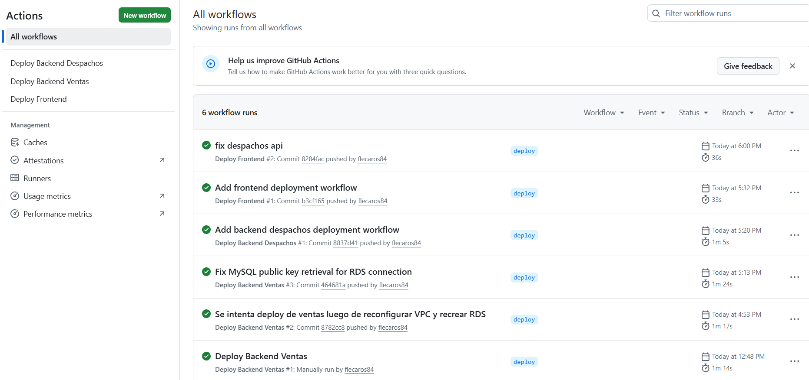

# Desarrollo EV2 Devops

Alumno: **Fabián Lecaros Ampuero**

## Paso 1: Crear el Repositorio

El primer paso es crear un repositorio en GitHub donde alojaremos el código fuente y los workflows de CI/CD.


## Paso 2: Acceder a la Configuración de 1eros Secretos

Las primeras secrets se obtienen desde el iniciador de laboratorios. Hay que hacer clic en AWS Details y luego en Show en la sección de AWS CLI. Estas se copian como secretos del repositorio antes creado en Github.

- `AWS_ACCESS_KEY_ID`: Identificador de la clave de acceso de AWS.
- `AWS_SECRET_ACCESS_KEY`: Clave secreta de acceso de AWS.
- `AWS_SESSION_TOKEN`: Token de sesión temporal de AWS.
- `AWS_REGION`: Región de AWS donde se despliegan los recursos.


## Paso 3: Creación de Repositorios ECR (Containers)

Dentro de ECR, creamos un nuevo repositorio para cada uno de nuestros servicios.


## Paso 4: Configurar Secretos de Repositorios ECR

Ahora se deben configurar los secret correspondientes a los repositorios ECR:

- `ECR_REPO_URL_BACKEND_DESPACHOS`
- `ECR_REPO_URL_BACKEND_VENTAS`
- `ECR_REPO_URL_FRONTEND`
- `ECR_REGISTRY`


## Paso 5: Configuración de Instancias EC2

Se utilizán instancias previamente usadas, solo copiando una de App para tener 2 (para los dos backend de evaluación) y renombrandolas para que sean consistentes con los nombres de los servicios proporcionados en la evaluación.


## Paso 6: Configurar Secretos de Instancias EC2

Ahora se deben configurar los secret correspondientes a las instancias EC2:

- `EC2_BACKEND_DESPACHOS_INSTANCE_ID`
- `EC2_BACKEND_VENTAS_INSTANCE_ID`
- `EC2_FRONTEND_INSTANCE_ID`


## Paso 7: Configurar DB MYSQL en AWS RDS

Dado que los backend entregados en el projecto consideraban una DB MySQL en AWS RDS, se debe configurar la misma.


## Paso 8: Configurar Secretos para DB MYSQL

Ahora se deben configurar los secret correspondientes a la DB MySQL:

- `DB_ENDPOINT`
- `DB_PORT`
- `DB_NAME`
- `DB_USERNAME`
- `DB_PASSWORD`


## Paso 9: Ajustar puertos en los Backend

Se dejaran los puertos del backend explicitamente en 8080 dado que ambos correran en instancias distintas.


## Paso 10: Contenerización de los servicios

Para permitir el despliegue de los componentes mediante Docker, se agregaron archivos `Dockerfile` para cada servicio del proyecto:

- Backend Ventas:  
  `back-Ventas_SpringBoot/Springboot-API-REST/Dockerfile`

- Backend Despachos:  
  `back-Despachos_SpringBoot/Springboot-API-REST-DESPACHO/Dockerfile`

- Frontend:  
  `front_despacho/Dockerfile`

Los backends se construyen usando una imagen Maven con Java 17 y luego se ejecutan en una imagen liviana de Java Runtime. El frontend se construye con Node y luego se sirve mediante Nginx.

### Dockerfile usado para los backends

```dockerfile
FROM maven:3.9.9-eclipse-temurin-17 AS build

WORKDIR /app

COPY pom.xml .

RUN mvn dependency:go-offline -B

COPY src src

RUN mvn clean package -DskipTests

FROM eclipse-temurin:17-jre-alpine

WORKDIR /app

RUN addgroup -S spring && adduser -S spring -G spring
USER spring

COPY --from=build /app/target/*.jar app.jar

EXPOSE 8080

ENTRYPOINT ["java", "-jar", "app.jar"]
```

### Dockerfile usado para el frontend

```dockerfile
FROM node:20-alpine AS build

WORKDIR /app

COPY package*.json ./
RUN npm ci

COPY . .

ARG VITE_API_DESPACHOS_URL=""
ARG VITE_API_VENTAS_URL=""

ENV VITE_API_DESPACHOS_URL=$VITE_API_DESPACHOS_URL
ENV VITE_API_VENTAS_URL=$VITE_API_VENTAS_URL

RUN npm run build

FROM nginx:alpine

COPY nginx.conf.template /etc/nginx/templates/default.conf.template
COPY --from=build /app/dist /usr/share/nginx/html

EXPOSE 80

CMD ["nginx", "-g", "daemon off;"]
```

---

## Paso 11: Configuración de Docker Compose

Se agregó un archivo `docker-compose.yml` en la raíz del proyecto para permitir levantar los servicios de forma conjunta en ambiente local o de prueba.

El objetivo de este archivo es cumplir con la ejecución integrada de los servicios, permitiendo construir y levantar:

- Backend Ventas.
- Backend Despachos.
- Frontend.

En producción, los servicios se despliegan de manera separada en instancias EC2 distintas, pero el archivo `docker-compose.yml` permite demostrar la composición de la aplicación.

```yaml
services:
  backend-despachos:
    build:
      context: ./back-Despachos_SpringBoot/Springboot-API-REST-DESPACHO
      dockerfile: Dockerfile
    image: backend-despachos:local
    container_name: backend-despachos
    ports:
      - "8081:8080"
    environment:
      DB_ENDPOINT: ${DB_ENDPOINT}
      DB_PORT: ${DB_PORT}
      DB_NAME: ${DB_NAME}
      DB_USERNAME: ${DB_USERNAME}
      DB_PASSWORD: ${DB_PASSWORD}
    networks:
      - app-network
    restart: unless-stopped

  backend-ventas:
    build:
      context: ./back-Ventas_SpringBoot/Springboot-API-REST
      dockerfile: Dockerfile
    image: backend-ventas:local
    container_name: backend-ventas
    ports:
      - "8082:8080"
    environment:
      DB_ENDPOINT: ${DB_ENDPOINT}
      DB_PORT: ${DB_PORT}
      DB_NAME: ${DB_NAME}
      DB_USERNAME: ${DB_USERNAME}
      DB_PASSWORD: ${DB_PASSWORD}
    networks:
      - app-network
    restart: unless-stopped

  frontend:
    build:
      context: ./front_despacho
      dockerfile: Dockerfile
      args:
        VITE_API_DESPACHOS_URL: ""
        VITE_API_VENTAS_URL: ""
    image: frontend-despacho:local
    container_name: frontend-despacho
    ports:
      - "80:80"
    environment:
      BACKEND_DESPACHOS_URL: http://backend-despachos:8080
      BACKEND_VENTAS_URL: http://backend-ventas:8080
    depends_on:
      - backend-despachos
      - backend-ventas
    networks:
      - app-network
    restart: unless-stopped

networks:
  app-network:
    driver: bridge
```

---

## Paso 12: Ajuste de conexión MySQL para RDS

Durante el despliegue se detectó que los backends lograban alcanzar la base de datos RDS, pero fallaban con el error:

```text
Public Key Retrieval is not allowed
```

Para corregirlo, se agregó el parámetro `allowPublicKeyRetrieval=true` en la URL JDBC de ambos backends.

### Backend Ventas

Archivo:

```text
back-Ventas_SpringBoot/Springboot-API-REST/src/main/resources/application.properties
```

Configuración final:

```properties
spring.datasource.url=jdbc:mysql://${DB_ENDPOINT}:${DB_PORT}/${DB_NAME}?useSSL=false&allowPublicKeyRetrieval=true&serverTimezone=UTC&createDatabaseIfNotExist=true
```

### Backend Despachos

Archivo:

```text
back-Despachos_SpringBoot/Springboot-API-REST-DESPACHO/src/main/resources/application.properties
```

Configuración final:

```properties
spring.datasource.url=jdbc:mysql://${DB_ENDPOINT}:${DB_PORT}/${DB_NAME}?useSSL=false&allowPublicKeyRetrieval=true&serverTimezone=UTC&createDatabaseIfNotExist=true
```

---

## Paso 13: Corrección de arquitectura de red

Durante las pruebas se identificó que algunas instancias backend habían sido creadas en una VPC distinta a la usada por el frontend, los grupos de seguridad y la base de datos RDS.

Para corregirlo, se crearon nuevas instancias backend en la VPC correcta:

```text
VPC: vpc-05d398d3a49d9391f
```

Se mantuvo la arquitectura:

```text
Usuario
  ↓
EC2 Frontend
  ↓
EC2 Backend Ventas / EC2 Backend Despachos
  ↓
Amazon RDS MySQL
```

Las nuevas instancias backend fueron configuradas con:

- Security Group `GrupoApp`.
- IAM Role compatible con Systems Manager.
- Docker instalado.
- AWS CLI instalado.
- Swap de 1 GB para mejorar la estabilidad de Spring Boot en instancias pequeñas.



---

## Paso 14: Configuración de Systems Manager y Docker en EC2

Para que GitHub Actions pudiera ejecutar comandos remotos en las instancias EC2, se utilizó AWS Systems Manager.

Las instancias backend y frontend debían aparecer en:

```text
Systems Manager > Fleet Manager
```

Luego se instaló Docker, AWS CLI y swap usando `AWS-RunShellScript`.

Script utilizado:

```bash
echo "=== Instalando Docker y AWS CLI ==="

sudo dnf update -y || sudo yum update -y

sudo dnf install -y docker awscli || sudo yum install -y docker awscli

sudo systemctl enable docker
sudo systemctl start docker

echo "=== Crear swap si no existe ==="

if [ ! -f /swapfile ]; then
  sudo fallocate -l 1G /swapfile
  sudo chmod 600 /swapfile
  sudo mkswap /swapfile
  sudo swapon /swapfile
  echo '/swapfile none swap sw 0 0' | sudo tee -a /etc/fstab
else
  sudo swapon /swapfile || true
fi

echo "=== Versiones ==="
docker --version
aws --version

echo "=== Memoria ==="
free -h

echo "=== Estado Docker ==="
sudo systemctl status docker --no-pager
```



---

## Paso 15: Configuración de Security Groups

Para permitir la comunicación entre los servicios, se revisaron y ajustaron los grupos de seguridad.

### GrupoWeb

Corresponde a la instancia frontend.

Debe permitir acceso HTTP desde internet:

```text
HTTP | 80 | 0.0.0.0/0
```



### GrupoApp

Corresponde a las instancias backend.

Debe permitir tráfico desde el frontend hacia los backends por el puerto usado por Spring Boot:

```text
Custom TCP | 8080 | Origen: GrupoWeb
```

También debe permitir salida hacia la base de datos y servicios AWS:

```text
All traffic | 0.0.0.0/0
```



### GrupoData

Corresponde a la base de datos RDS.

Debe permitir MySQL solamente desde los backends:

```text
MySQL/Aurora | 3306 | Origen: GrupoApp
```


---

## Paso 16: Workflow de despliegue Backend Ventas

Se agregó el workflow:

```text
.github/workflows/deploy-backend-ventas.yml
```

Este workflow realiza:

1. Checkout del repositorio.
2. Configuración de credenciales AWS.
3. Login en Amazon ECR.
4. Build de imagen Docker.
5. Push de imagen a ECR.
6. Deploy remoto en EC2 mediante SSM.

```yaml
name: Deploy Backend Ventas

on:
  push:
    branches:
      - deploy
    paths:
      - "back-Ventas_SpringBoot/**"
      - ".github/workflows/deploy-backend-ventas.yml"
  workflow_dispatch:

jobs:
  deploy:
    runs-on: ubuntu-latest

    steps:
      - name: Checkout repository
        uses: actions/checkout@v4

      - name: Configure AWS credentials
        uses: aws-actions/configure-aws-credentials@v4
        with:
          aws-access-key-id: ${{ secrets.AWS_ACCESS_KEY_ID }}
          aws-secret-access-key: ${{ secrets.AWS_SECRET_ACCESS_KEY }}
          aws-session-token: ${{ secrets.AWS_SESSION_TOKEN }}
          aws-region: ${{ secrets.AWS_REGION }}

      - name: Login to Amazon ECR
        run: |
          aws ecr get-login-password --region ${{ secrets.AWS_REGION }} \
          | docker login --username AWS --password-stdin ${{ secrets.ECR_REGISTRY }}

      - name: Build Docker image
        working-directory: back-Ventas_SpringBoot/Springboot-API-REST
        run: |
          docker build -t ${{ secrets.ECR_REPO_URL_BACKEND_VENTAS }}:latest .

      - name: Push Docker image to ECR
        run: |
          docker push ${{ secrets.ECR_REPO_URL_BACKEND_VENTAS }}:latest

      - name: Deploy container on EC2 with SSM
        run: |
          aws ssm send-command \
            --instance-ids "${{ secrets.EC2_BACKEND_VENTAS_INSTANCE_ID }}" \
            --document-name "AWS-RunShellScript" \
            --comment "Deploy backend ventas" \
            --parameters 'commands=[
              "aws ecr get-login-password --region ${{ secrets.AWS_REGION }} | docker login --username AWS --password-stdin ${{ secrets.ECR_REGISTRY }}",
              "docker stop backend-ventas || true",
              "docker rm backend-ventas || true",
              "docker pull ${{ secrets.ECR_REPO_URL_BACKEND_VENTAS }}:latest",
              "docker run -d --name backend-ventas --restart unless-stopped -p 8080:8080 -e JAVA_TOOL_OPTIONS=\"-Xms128m -Xmx384m\" -e DB_ENDPOINT=${{ secrets.DB_ENDPOINT }} -e DB_PORT=${{ secrets.DB_PORT }} -e DB_NAME=${{ secrets.DB_NAME }} -e DB_USERNAME=${{ secrets.DB_USERNAME }} -e DB_PASSWORD=${{ secrets.DB_PASSWORD }} ${{ secrets.ECR_REPO_URL_BACKEND_VENTAS }}:latest"
            ]'
```

---

## Paso 17: Workflow de despliegue Backend Despachos

Se agregó el workflow:

```text
.github/workflows/deploy-backend-despachos.yml
```

```yaml
name: Deploy Backend Despachos

on:
  push:
    branches:
      - deploy
    paths:
      - "back-Despachos_SpringBoot/**"
      - ".github/workflows/deploy-backend-despachos.yml"
  workflow_dispatch:

jobs:
  deploy:
    runs-on: ubuntu-latest

    steps:
      - name: Checkout repository
        uses: actions/checkout@v4

      - name: Configure AWS credentials
        uses: aws-actions/configure-aws-credentials@v4
        with:
          aws-access-key-id: ${{ secrets.AWS_ACCESS_KEY_ID }}
          aws-secret-access-key: ${{ secrets.AWS_SECRET_ACCESS_KEY }}
          aws-session-token: ${{ secrets.AWS_SESSION_TOKEN }}
          aws-region: ${{ secrets.AWS_REGION }}

      - name: Login to Amazon ECR
        run: |
          aws ecr get-login-password --region ${{ secrets.AWS_REGION }} \
          | docker login --username AWS --password-stdin ${{ secrets.ECR_REGISTRY }}

      - name: Build Docker image
        working-directory: back-Despachos_SpringBoot/Springboot-API-REST-DESPACHO
        run: |
          docker build -t ${{ secrets.ECR_REPO_URL_BACKEND_DESPACHOS }}:latest .

      - name: Push Docker image to ECR
        run: |
          docker push ${{ secrets.ECR_REPO_URL_BACKEND_DESPACHOS }}:latest

      - name: Deploy container on EC2 with SSM
        run: |
          aws ssm send-command \
            --instance-ids "${{ secrets.EC2_BACKEND_DESPACHOS_INSTANCE_ID }}" \
            --document-name "AWS-RunShellScript" \
            --comment "Deploy backend despachos" \
            --parameters 'commands=[
              "aws ecr get-login-password --region ${{ secrets.AWS_REGION }} | docker login --username AWS --password-stdin ${{ secrets.ECR_REGISTRY }}",
              "docker stop backend-despachos || true",
              "docker rm backend-despachos || true",
              "docker pull ${{ secrets.ECR_REPO_URL_BACKEND_DESPACHOS }}:latest",
              "docker run -d --name backend-despachos --restart unless-stopped -p 8080:8080 -e JAVA_TOOL_OPTIONS=\"-Xms128m -Xmx384m\" -e DB_ENDPOINT=${{ secrets.DB_ENDPOINT }} -e DB_PORT=${{ secrets.DB_PORT }} -e DB_NAME=${{ secrets.DB_NAME }} -e DB_USERNAME=${{ secrets.DB_USERNAME }} -e DB_PASSWORD=${{ secrets.DB_PASSWORD }} ${{ secrets.ECR_REPO_URL_BACKEND_DESPACHOS }}:latest"
            ]'
```

---

## Paso 18: Configuración del Frontend y Nginx como proxy

El frontend fue configurado para llamar rutas relativas:

```text
/api/v1/ventas
/api/v1/despachos
```

Estas rutas son recibidas por Nginx en el contenedor frontend y redirigidas a los backends usando las IP privadas de las instancias EC2.

Archivo:

```text
front_despacho/nginx.conf.template
```

```nginx
server {
    listen 80;
    server_name _;

    root /usr/share/nginx/html;
    index index.html;

    location /api/v1/ventas {
        proxy_pass ${BACKEND_VENTAS_URL};
        proxy_set_header Host $host;
        proxy_set_header X-Real-IP $remote_addr;
        proxy_set_header X-Forwarded-For $proxy_add_x_forwarded_for;
        proxy_set_header X-Forwarded-Proto $scheme;
    }

    location /api/v1/despachos {
        proxy_pass ${BACKEND_DESPACHOS_URL};
        proxy_set_header Host $host;
        proxy_set_header X-Real-IP $remote_addr;
        proxy_set_header X-Forwarded-For $proxy_add_x_forwarded_for;
        proxy_set_header X-Forwarded-Proto $scheme;
    }

    location / {
        try_files $uri /index.html;
    }
}
```

El archivo de configuración del frontend quedó así:

```text
front_despacho/src/config/api.js
```

```js
export const API_DESPACHOS_URL = import.meta.env.VITE_API_DESPACHOS_URL || "";
export const API_VENTAS_URL = import.meta.env.VITE_API_VENTAS_URL || "";
```

Además, se corrigió una URL mal escrita en `TableDespachos.jsx`, reemplazando una cadena literal por un template literal válido:

```js
.get(`${API_DESPACHOS_URL}/api/v1/despachos`, {
```

---

## Paso 19: Workflow de despliegue Frontend

Se agregó el workflow:

```text
.github/workflows/deploy-frontend.yml
```

Este workflow obtiene automáticamente las IP privadas de las instancias backend desde AWS EC2 y las inyecta como variables de entorno al contenedor frontend.

```yaml
name: Deploy Frontend

on:
  push:
    branches:
      - deploy
    paths:
      - "front_despacho/**"
      - ".github/workflows/deploy-frontend.yml"
  workflow_dispatch:

jobs:
  deploy:
    runs-on: ubuntu-latest

    steps:
      - name: Checkout repository
        uses: actions/checkout@v4

      - name: Configure AWS credentials
        uses: aws-actions/configure-aws-credentials@v4
        with:
          aws-access-key-id: ${{ secrets.AWS_ACCESS_KEY_ID }}
          aws-secret-access-key: ${{ secrets.AWS_SECRET_ACCESS_KEY }}
          aws-session-token: ${{ secrets.AWS_SESSION_TOKEN }}
          aws-region: ${{ secrets.AWS_REGION }}

      - name: Get backend private IPs
        run: |
          BACKEND_VENTAS_PRIVATE_IP=$(aws ec2 describe-instances \
            --instance-ids ${{ secrets.EC2_BACKEND_VENTAS_INSTANCE_ID }} \
            --query "Reservations[0].Instances[0].PrivateIpAddress" \
            --output text)

          BACKEND_DESPACHOS_PRIVATE_IP=$(aws ec2 describe-instances \
            --instance-ids ${{ secrets.EC2_BACKEND_DESPACHOS_INSTANCE_ID }} \
            --query "Reservations[0].Instances[0].PrivateIpAddress" \
            --output text)

          echo "BACKEND_VENTAS_URL=http://$BACKEND_VENTAS_PRIVATE_IP:8080" >> $GITHUB_ENV
          echo "BACKEND_DESPACHOS_URL=http://$BACKEND_DESPACHOS_PRIVATE_IP:8080" >> $GITHUB_ENV

      - name: Show backend URLs
        run: |
          echo "Backend Ventas URL: $BACKEND_VENTAS_URL"
          echo "Backend Despachos URL: $BACKEND_DESPACHOS_URL"

      - name: Login to Amazon ECR
        run: |
          aws ecr get-login-password --region ${{ secrets.AWS_REGION }} \
          | docker login --username AWS --password-stdin ${{ secrets.ECR_REGISTRY }}

      - name: Build Docker image
        working-directory: front_despacho
        run: |
          docker build \
            --build-arg VITE_API_DESPACHOS_URL="" \
            --build-arg VITE_API_VENTAS_URL="" \
            -t ${{ secrets.ECR_REPO_URL_FRONTEND }}:latest .

      - name: Push Docker image to ECR
        run: |
          docker push ${{ secrets.ECR_REPO_URL_FRONTEND }}:latest

      - name: Deploy container on EC2 with SSM
        run: |
          aws ssm send-command \
            --instance-ids "${{ secrets.EC2_FRONTEND_INSTANCE_ID }}" \
            --document-name "AWS-RunShellScript" \
            --comment "Deploy frontend despacho" \
            --parameters 'commands=[
              "aws ecr get-login-password --region ${{ secrets.AWS_REGION }} | docker login --username AWS --password-stdin ${{ secrets.ECR_REGISTRY }}",
              "docker stop frontend-despacho || true",
              "docker rm frontend-despacho || true",
              "docker pull ${{ secrets.ECR_REPO_URL_FRONTEND }}:latest",
              "docker run -d --name frontend-despacho --restart unless-stopped -p 80:80 -e BACKEND_VENTAS_URL=${{ env.BACKEND_VENTAS_URL }} -e BACKEND_DESPACHOS_URL=${{ env.BACKEND_DESPACHOS_URL }} ${{ secrets.ECR_REPO_URL_FRONTEND }}:latest"
            ]'
```

---

## Paso 20: Validación del despliegue

Se validó el funcionamiento de los tres componentes.

### Validación Backend Ventas

Desde Systems Manager:

```bash
docker ps
docker logs backend-ventas --tail 150
```

Resultado esperado:

```text
backend-ventas   Up
Started SpringbootApiRestApplication
HikariPool-1 - Start completed
```

### Validación Backend Despachos

Desde Systems Manager:

```bash
docker ps
docker logs backend-despachos --tail 150
```

Resultado esperado:

```text
backend-despachos   Up
Started SpringbootApiRestDespachoApplication
HikariPool-1 - Start completed
```

### Validación Frontend

Desde navegador:

```text
http://IP_PUBLICA_FRONTEND
```

### Validación API Ventas desde PC

Desde PowerShell:

```powershell
Invoke-RestMethod -Uri "http://IP_PUBLICA_FRONTEND/api/v1/ventas"
```

Resultado inicial esperado:

```json
[]
```

Esto confirma el flujo:

```text
PC -> Frontend/Nginx -> Backend Ventas -> RDS
```

## Paso 21: Evidencia de Despliegue desde Github Actions

A continuación se muestran los workflows ejecutados para el despliegue.



---

## Colección Postman para pruebas en vivo

La siguiente colección permite probar el flujo completo:

- `GET /api/v1/ventas`
- `POST /api/v1/ventas`
- `GET /api/v1/despachos`

Antes de usarla, cambiar la variable `base_url` por la IP pública real del frontend.

```json
{
  "info": {
    "name": "DevOps Parcial 02 - Pruebas API",
    "_postman_id": "9e9ad9d5-1f7d-4b3f-8b4e-devops-parcial02",
    "description": "Colección para validar el flujo Frontend/Nginx -> Backend -> RDS.",
    "schema": "https://schema.getpostman.com/json/collection/v2.1.0/collection.json"
  },
  "variable": [
    {
      "key": "base_url",
      "value": "http://IP_PUBLICA_FRONTEND",
      "type": "string"
    }
  ],
  "item": [
    {
      "name": "Ventas - Listar ventas",
      "request": {
        "method": "GET",
        "header": [],
        "url": {
          "raw": "{{base_url}}/api/v1/ventas",
          "host": [
            "{{base_url}}"
          ],
          "path": [
            "api",
            "v1",
            "ventas"
          ]
        }
      }
    },
    {
      "name": "Ventas - Crear venta 1",
      "request": {
        "method": "POST",
        "header": [
          {
            "key": "Content-Type",
            "value": "application/json"
          }
        ],
        "body": {
          "mode": "raw",
          "raw": "{\n  \"direccionCompra\": \"P Sherman Calle Wallabi 42 Syndey\",\n  \"valorCompra\": 22990,\n  \"fechaCompra\": \"2024-02-02\",\n  \"despachoGenerado\": false\n}"
        },
        "url": {
          "raw": "{{base_url}}/api/v1/ventas",
          "host": [
            "{{base_url}}"
          ],
          "path": [
            "api",
            "v1",
            "ventas"
          ]
        }
      }
    },
    {
      "name": "Ventas - Crear venta 2",
      "request": {
        "method": "POST",
        "header": [
          {
            "key": "Content-Type",
            "value": "application/json"
          }
        ],
        "body": {
          "mode": "raw",
          "raw": "{\n  \"direccionCompra\": \"Avenida siempre viva 69\",\n  \"valorCompra\": 12590,\n  \"fechaCompra\": \"2024-03-05\",\n  \"despachoGenerado\": false\n}"
        },
        "url": {
          "raw": "{{base_url}}/api/v1/ventas",
          "host": [
            "{{base_url}}"
          ],
          "path": [
            "api",
            "v1",
            "ventas"
          ]
        }
      }
    },
    {
      "name": "Ventas - Crear venta 3",
      "request": {
        "method": "POST",
        "header": [
          {
            "key": "Content-Type",
            "value": "application/json"
          }
        ],
        "body": {
          "mode": "raw",
          "raw": "{\n  \"direccionCompra\": \"Avenida Por atrás 1313\",\n  \"valorCompra\": 13990,\n  \"fechaCompra\": \"2024-04-20\",\n  \"despachoGenerado\": false\n}"
        },
        "url": {
          "raw": "{{base_url}}/api/v1/ventas",
          "host": [
            "{{base_url}}"
          ],
          "path": [
            "api",
            "v1",
            "ventas"
          ]
        }
      }
    },
    {
      "name": "Ventas - Crear venta 4",
      "request": {
        "method": "POST",
        "header": [
          {
            "key": "Content-Type",
            "value": "application/json"
          }
        ],
        "body": {
          "mode": "raw",
          "raw": "{\n  \"direccionCompra\": \"Calle presidente kirby 8528\",\n  \"valorCompra\": 9990,\n  \"fechaCompra\": \"2024-04-15\",\n  \"despachoGenerado\": false\n}"
        },
        "url": {
          "raw": "{{base_url}}/api/v1/ventas",
          "host": [
            "{{base_url}}"
          ],
          "path": [
            "api",
            "v1",
            "ventas"
          ]
        }
      }
    },
    {
      "name": "Despachos - Listar despachos",
      "request": {
        "method": "GET",
        "header": [],
        "url": {
          "raw": "{{base_url}}/api/v1/despachos",
          "host": [
            "{{base_url}}"
          ],
          "path": [
            "api",
            "v1",
            "despachos"
          ]
        }
      }
    }
  ]
}
```

---

## Troubleshooting

### 1. Error `voc-cancel-cred`

Mensaje típico:

```text
explicit deny in an identity-based policy: voc-cancel-cred
```

Causa:

Las credenciales temporales del laboratorio AWS expiraron o fueron canceladas.

Solución:

Actualizar en GitHub Secrets:

```text
AWS_ACCESS_KEY_ID
AWS_SECRET_ACCESS_KEY
AWS_SESSION_TOKEN
```

Luego reejecutar el workflow.

---

### 2. Error `InvalidInstanceId` en SSM

Mensaje típico:

```text
InvalidInstanceId: Instances not in a valid state for account
```

Causas probables:

- La instancia EC2 no está encendida.
- La instancia no aparece en Fleet Manager.
- El secret `EC2_BACKEND_*_INSTANCE_ID` tiene un ID antiguo.
- El laboratorio fue reiniciado y las instancias no estaban listas.

Solución:

1. Iniciar las instancias EC2.
2. Esperar a que aparezcan en Fleet Manager.
3. Confirmar que están `Online`.
4. Revisar que los secrets apunten a los Instance ID correctos.
5. Reintentar el workflow.

---

### 3. Error `docker: command not found`

Causa:

Docker no está instalado en la instancia EC2.

Solución:

Ejecutar por Systems Manager:

```bash
sudo dnf install -y docker awscli || sudo yum install -y docker awscli
sudo systemctl enable docker
sudo systemctl start docker
docker --version
```

---

### 4. Contenedor Spring Boot cae con `Exited (137)`

Causa probable:

La instancia tiene poca memoria disponible.

Solución:

Agregar swap y limitar memoria Java:

```bash
sudo fallocate -l 1G /swapfile
sudo chmod 600 /swapfile
sudo mkswap /swapfile
sudo swapon /swapfile
echo '/swapfile none swap sw 0 0' | sudo tee -a /etc/fstab
```

En el workflow usar:

```text
-e JAVA_TOOL_OPTIONS="-Xms128m -Xmx384m"
```

---

### 5. Error `Public Key Retrieval is not allowed`

Causa:

MySQL 8 requiere permitir recuperación de clave pública cuando se usa `caching_sha2_password` sin SSL.

Solución:

Agregar `allowPublicKeyRetrieval=true` en la URL JDBC:

```properties
spring.datasource.url=jdbc:mysql://${DB_ENDPOINT}:${DB_PORT}/${DB_NAME}?useSSL=false&allowPublicKeyRetrieval=true&serverTimezone=UTC&createDatabaseIfNotExist=true
```

---

### 6. Error `504 Gateway Time-out` desde Nginx

Causa:

El frontend/Nginx no logra comunicarse con el backend.

Revisar:

1. Que el backend esté arriba:

```bash
docker ps
```

2. Que desde `instancia_front` se pueda llegar al backend:

```bash
curl -i http://IP_PRIVADA_BACKEND:8080/api/v1/ventas
```

3. Que `GrupoApp` permita entrada:

```text
Custom TCP | 8080 | Origen: GrupoWeb
```

4. Que el frontend tenga las variables correctas:

```bash
docker inspect frontend-despacho --format='{{range .Config.Env}}{{println .}}{{end}}' | grep BACKEND
```

---

### 7. El frontend muestra rutas extrañas con `${API_DESPACHOS_URL}`

Causa:

Una URL quedó escrita como texto literal en React.

Ejemplo incorrecto:

```js
.get("`${API_DESPACHOS_URL}/api/v1/despachos`")
```

Ejemplo correcto:

```js
.get(`${API_DESPACHOS_URL}/api/v1/despachos`)
```

---

### 8. La API responde `[]`

Esto no es un error.

Significa que la conexión funciona, pero la tabla está vacía.

Para cargar datos, usar Postman o PowerShell con `POST /api/v1/ventas`.

---

## Resultado final

El despliegue final quedó compuesto por:

```text
Frontend React/Vite + Nginx en EC2
Backend Ventas Spring Boot en EC2
Backend Despachos Spring Boot en EC2
Base de datos Amazon RDS MySQL
Imágenes Docker almacenadas en Amazon ECR
Despliegue automatizado con GitHub Actions y AWS Systems Manager
```

La validación final confirmó el flujo:

```text
Usuario / Navegador
  ↓
EC2 Frontend / Nginx
  ↓
EC2 Backend Ventas / EC2 Backend Despachos
  ↓
Amazon RDS MySQL
```
