# Desarrollo EV2 Devops

Alumno: **Fabián Lecaros Ampuero**

## Paso 1: Crear el Repositorio

El primer paso es crear un repositorio en GitHub donde alojaremos el código fuente y los workflows de CI/CD.

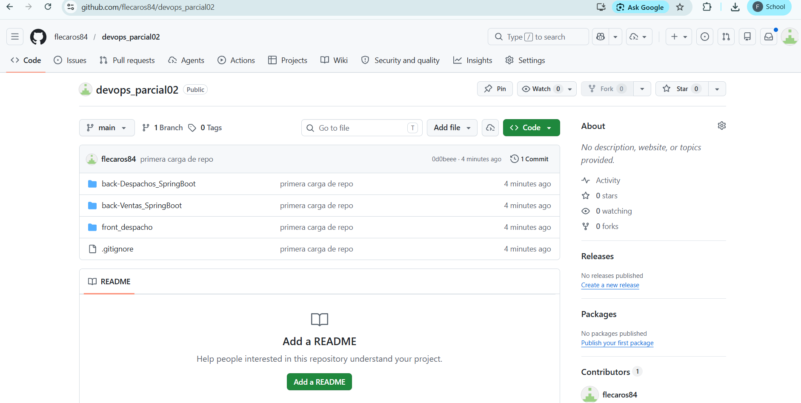

## Paso 2: Acceder a la Configuración de 1eros Secretos

Las primeras secrets se obtienen desde el iniciador de laboratorios. Hay que hacer clic en AWS Details y luego en Show en la sección de AWS CLI. Estas se copian como secretos del repositorio antes creado en Github.

- `AWS_ACCESS_KEY_ID`: Identificador de la clave de acceso de AWS.
- `AWS_SECRET_ACCESS_KEY`: Clave secreta de acceso de AWS.
- `AWS_SESSION_TOKEN`: Token de sesión temporal de AWS.
- `AWS_REGION`: Región de AWS donde se despliegan los recursos.

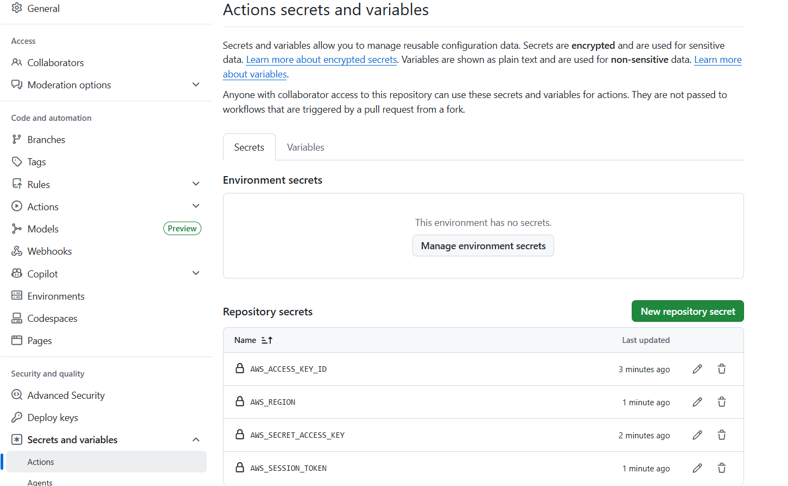

## Paso 3: Creación de Repositorios ECR (Containers)

Dentro de ECR, creamos un nuevo repositorio para cada uno de nuestros servicios.

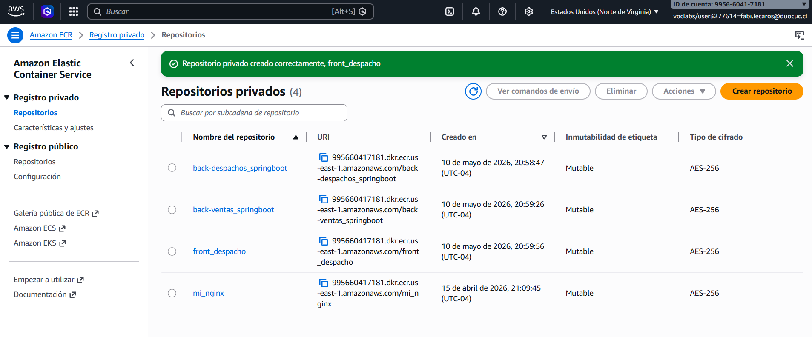

## Paso 4: Configurar Secretos de Repositorios ECR

Ahora se deben configurar los secret correspondientes a los repositorios ECR:

- `ECR_REPO_URL_BACKEND_DESPACHOS`
- `ECR_REPO_URL_BACKEND_VENTAS`
- `ECR_REPO_URL_FRONTEND`
- `ECR_REGISTRY`

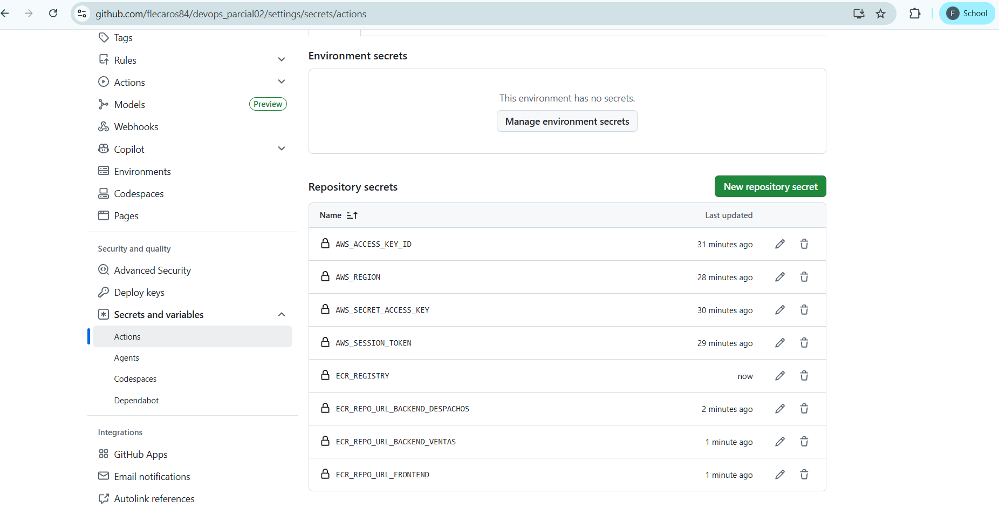

## Paso 5: Configuración de Instancias EC2

Se utilizán instancias previamente usadas, solo copiando una de App para tener 2 (para los dos backend de evaluación) y renombrandolas para que sean consistentes con los nombres de los servicios proporcionados en la evaluación.

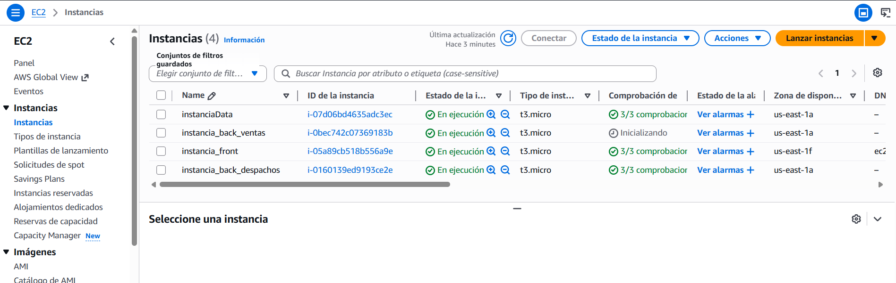

## Paso 6: Configurar Secretos de Instancias EC2

Ahora se deben configurar los secret correspondientes a las instancias EC2:

- `EC2_BACKEND_DESPACHOS_INSTANCE_ID`
- `EC2_BACKEND_VENTAS_INSTANCE_ID`
- `EC2_FRONTEND_INSTANCE_ID`

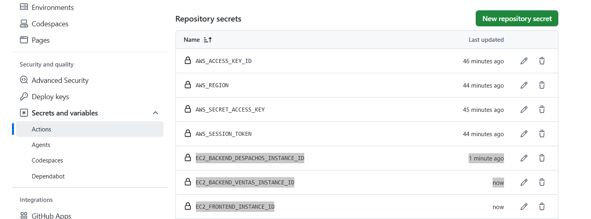

## Paso 7: Configurar DB MYSQL en AWS RDS

Dado que los backend entregados en el projecto consideraban una DB MySQL en AWS RDS, se debe configurar la misma.

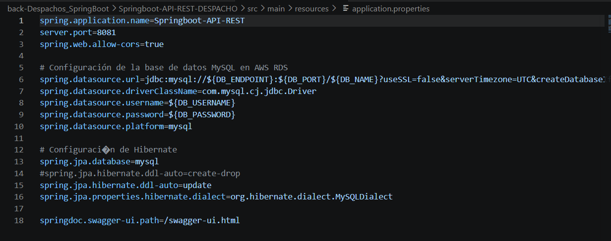

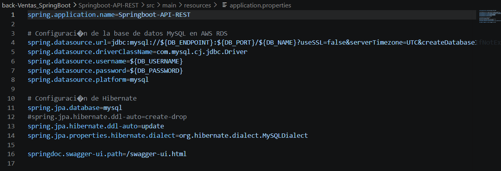

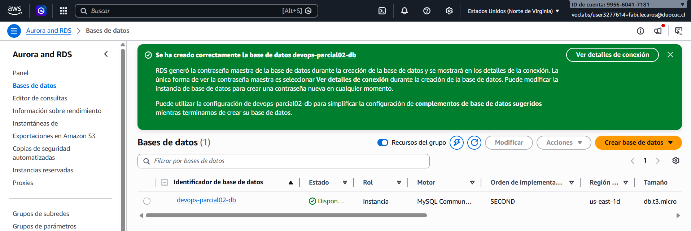

## Paso 8: Configurar Secretos para DB MYSQL

Ahora se deben configurar los secret correspondientes a la DB MySQL:

- `DB_ENDPOINT`
- `DB_PORT`
- `DB_NAME`
- `DB_USERNAME`
- `DB_PASSWORD`

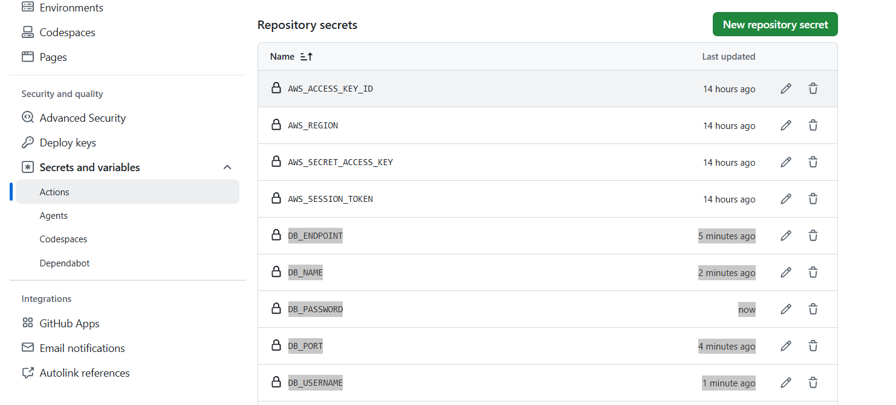

## Paso 9: Ajustar puertos en los Backend

Se dejaran los puertos del backend explicitamente en 8080 dado que ambos correran en instancias distintas.

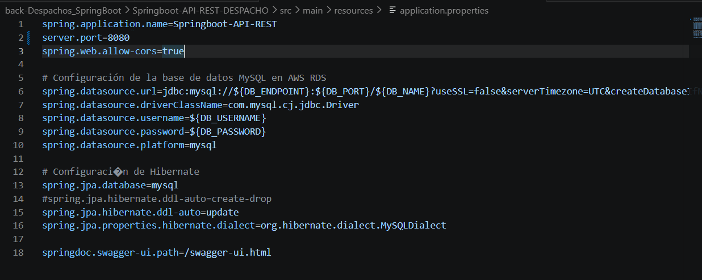

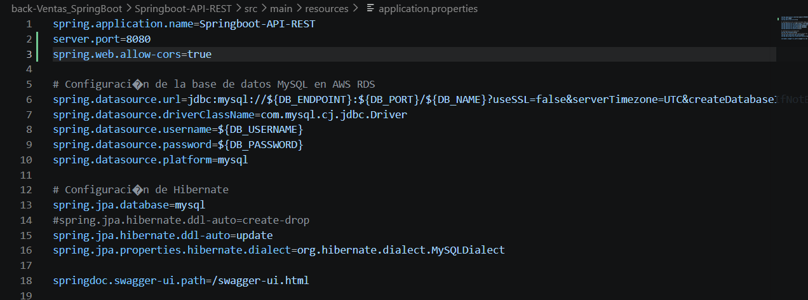